# OpenOcean

OpenOcean is the most efficient DEX aggregator protocol for crypto trading that sources liquidity from DeFi markets and enables cross-chain swaps.

- Cross-chain support
- Derivatives product aggregation
- All type of users coverage

## Helpers Overview

After forking repo type ```npm i``` in your terminal.

To run the project type ```npm run dev```.

For running separate .js file type ```cd src``` then ```node <FileName>.js```.

## Aggregator API Response

### Price Quote


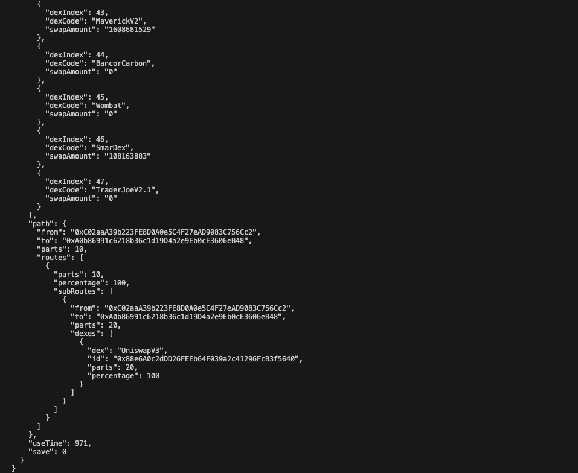

### Building Transaction

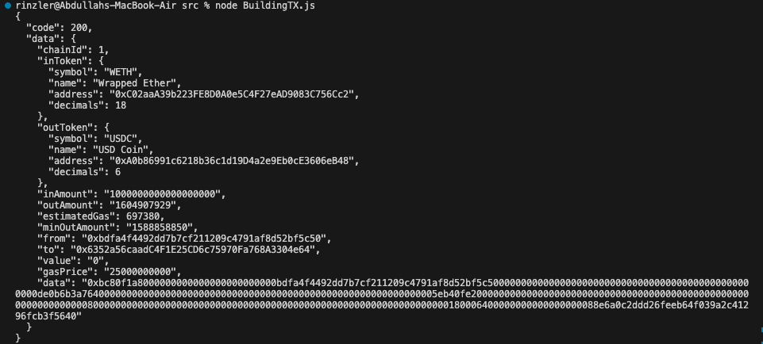

### Get Transaction

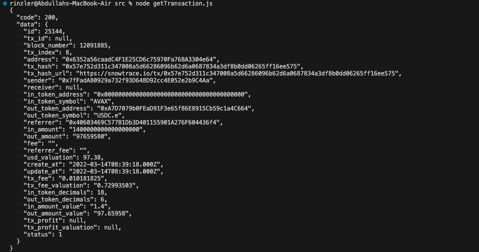

### Get Token Lists

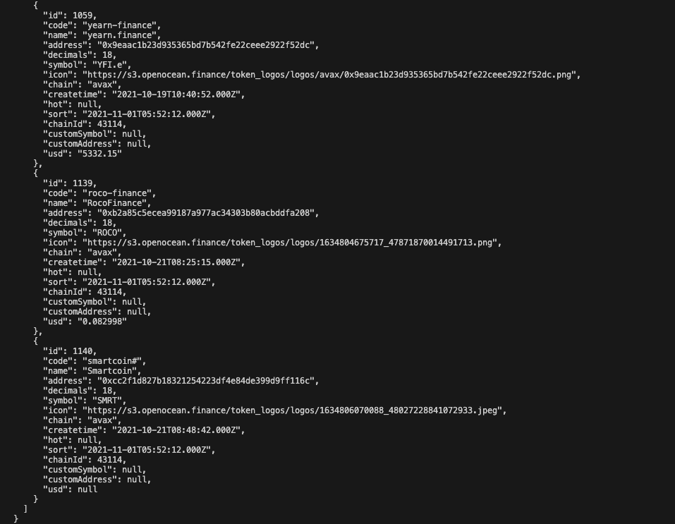

### Get Dexes List

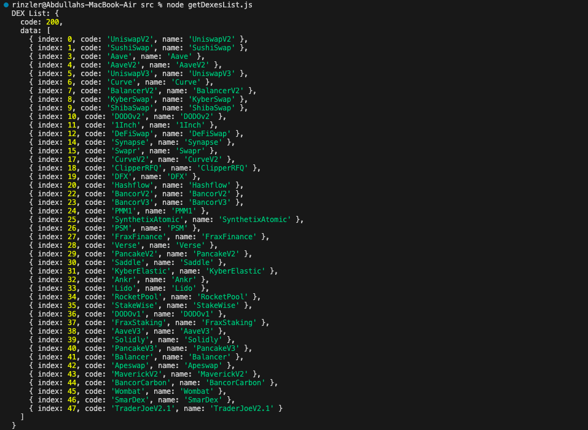

### Get Transaction Hash

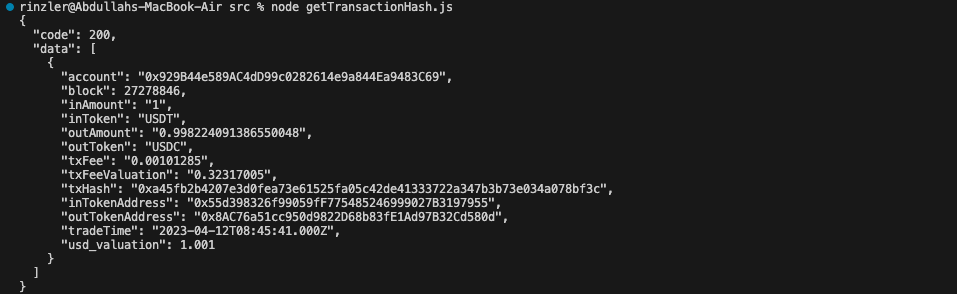

### Get Balance

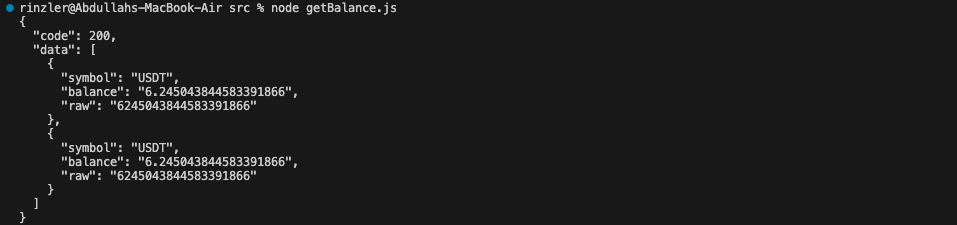

### Create Wallet

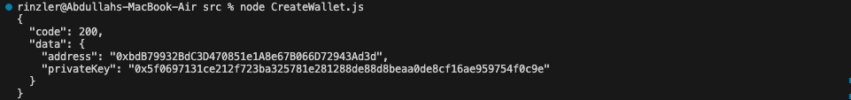

## Limit Order API Response

### Get limit order

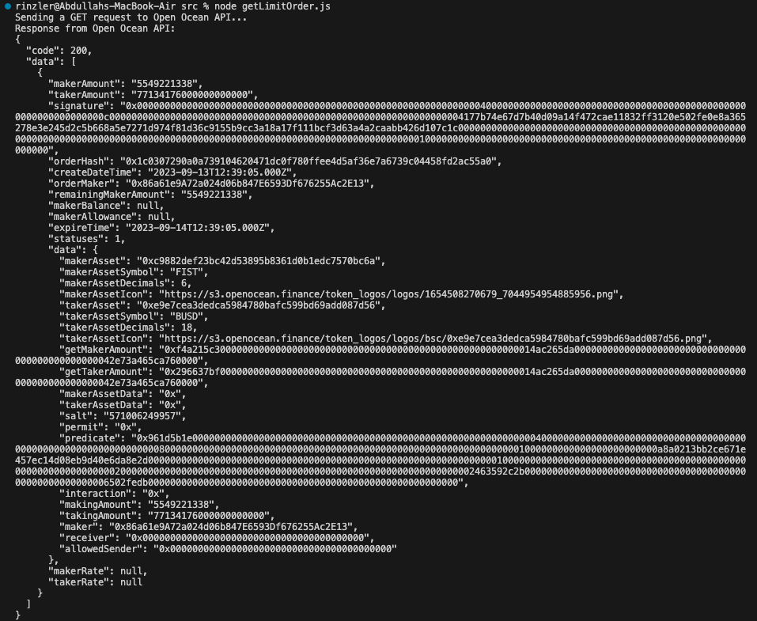

## Cross-Chain API Response

### Get Allowance

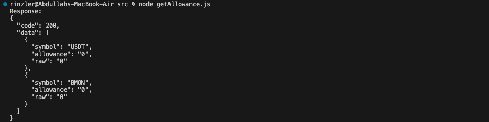

### Get MinSend

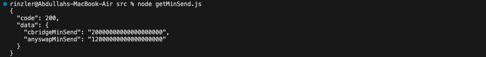

### Get Cross Status

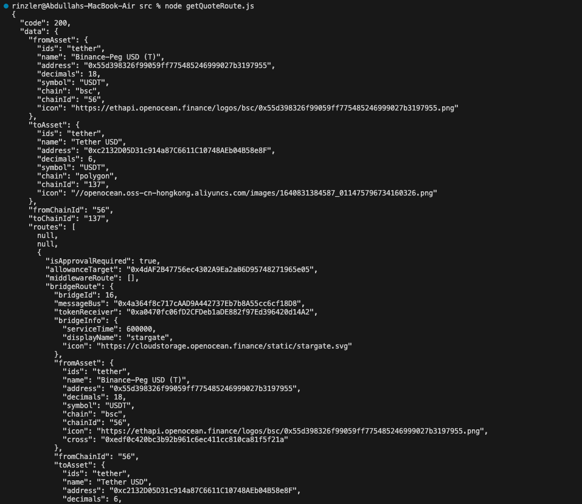

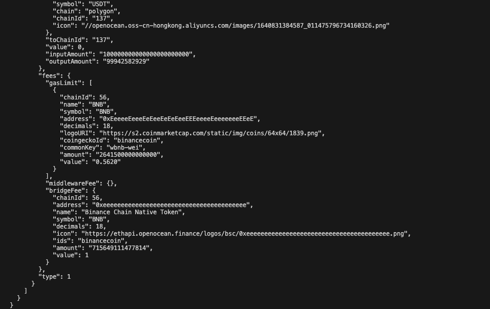