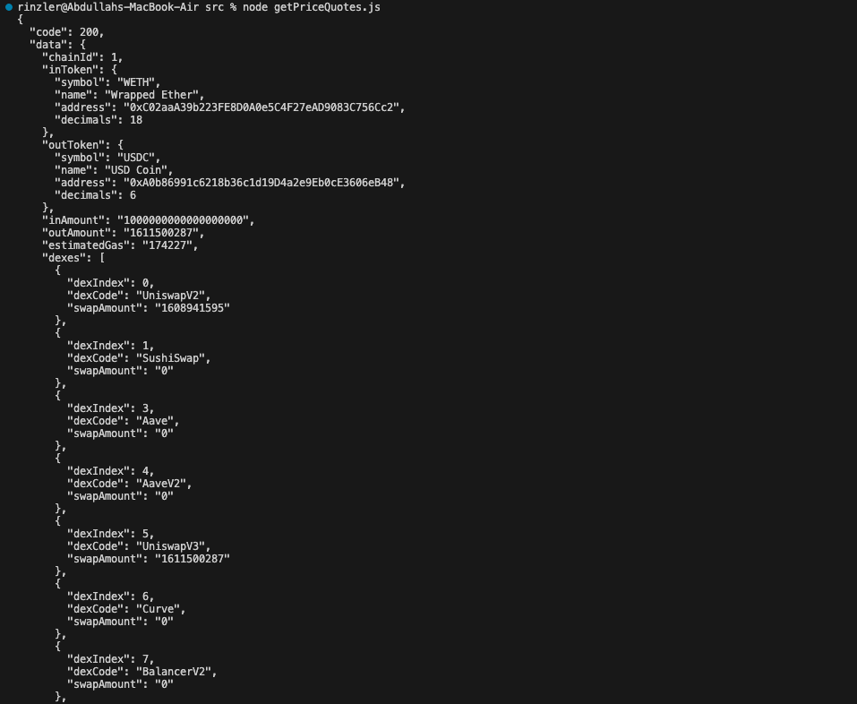

# OpenOcean

OpenOcean is the most efficient DEX aggregator protocol for crypto trading that sources liquidity from DeFi markets and enables cross-chain swaps.

## Helpers Overview

After forking repo type ```npm i``` in your terminal.

To run the project type ```npm run dev``` in your terminal.

# React + TypeScript + Vite

This template provides a minimal setup to get React working in Vite with HMR and some ESLint rules.

Currently, two official plugins are available:

- [@vitejs/plugin-react](https://github.com/vitejs/vite-plugin-react/blob/main/packages/plugin-react/README.md) uses [Babel](https://babeljs.io/) for Fast Refresh
- [@vitejs/plugin-react-swc](https://github.com/vitejs/vite-plugin-react-swc) uses [SWC](https://swc.rs/) for Fast Refresh

## Expanding the ESLint configuration

If you are developing a production application, we recommend updating the configuration to enable type aware lint rules:

- Configure the top-level `parserOptions` property like this:

```js
   parserOptions: {
    ecmaVersion: 'latest',
    sourceType: 'module',
    project: ['./tsconfig.json', './tsconfig.node.json'],
    tsconfigRootDir: __dirname,
   },
```

- Replace `plugin:@typescript-eslint/recommended` to `plugin:@typescript-eslint/recommended-type-checked` or `plugin:@typescript-eslint/strict-type-checked`
- Optionally add `plugin:@typescript-eslint/stylistic-type-checked`
- Install [eslint-plugin-react](https://github.com/jsx-eslint/eslint-plugin-react) and add `plugin:react/recommended` & `plugin:react/jsx-runtime` to the `extends` list

## Aggregator API

### Price Quote




### Building Transaction


### Get Transaction


### Get Token Lists


### Get Dexes List


### Get Transaction Hash


### Get Balance


### Create Wallet


## Limit Order API

### Get limit order


## Cross-Chain API

### Get Allowance


### Get MinSend


### Get Cross Status


